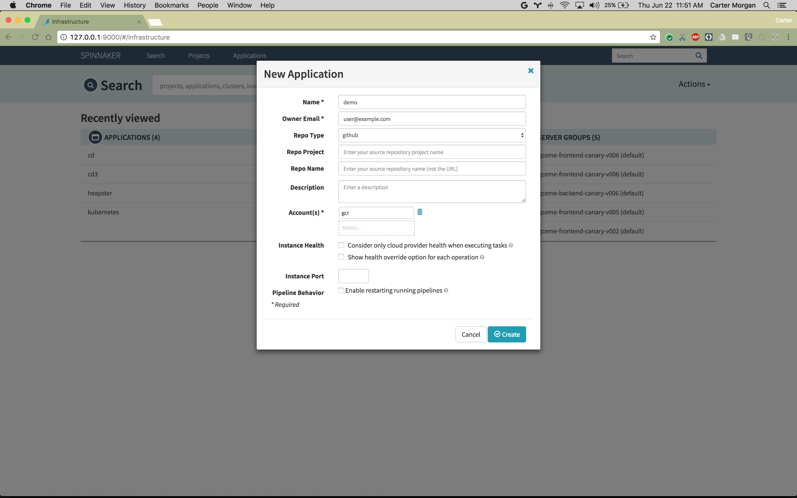

# Creating Your Pipeline

## Pipeline Overview


 
Dev  tags commit -->[GSR] --> [GCR builds image based on tag] -> [Spin deploys off of new image] -> [k8s]

## The Sample App
You'll use a very simple sample application - `gceme` - as the basis for your CD pipeline. `gceme` is written in Go and is located in the `sample-app` directory in this repo. When you run the `gceme` binary on a GCE instance, it displays the instance's metadata in a pretty card:


The binary supports two modes of operation, designed to mimic a microservice. In backend mode, `gceme` will listen on a port (8080 by default) and return GCE instance metadata as JSON, with content-type=application/json. In frontend mode, `gceme` will query a backend `gceme` service and render that JSON in the UI you saw above. It looks roughly like this:

```
-----------      ------------      ~~~~~~~~~~~~        -----------
|         |      |          |      |          |        |         |
|  user   | ---> |   gceme  | ---> | lb/proxy | -----> |  gceme  |
|(browser)|      |(frontend)|      |(optional)|   |    |(backend)|
|         |      |          |      |          |   |    |         |
-----------      ------------      ~~~~~~~~~~~~   |    -----------
                                                  |    -----------
                                                  |    |         |
                                                  |--> |  gceme  |
                                                       |(backend)|
                                                       |         |
                                                       -----------
```
Both the frontend and backend modes of the application support two additional URLs:

1. `/version` prints the version of the binary (declared as a const in `main.go`)
1. `/healthz` reports the health of the application. In frontend mode, health will be OK if the backend is reachable.

## Configuring Pipeline
All changes should be done from pipeline (as other configs will get overwritten when the pipeline pushes new versions from the old template).

Strategy=none is important for using deployments.  

## Create Application


Click, "Create Application" from the "Actions" menu, in the upper-right of the UI.



For Name, type "demo".

For email, enter an email address.

For the Repo Type, select "github".

In the Account(s) field, select "gcr".

Note: If gcr doesn't appear in the Account(s) field, our account credentials may not be set up correctly.  
 

## Create Load Balancers

Now it's time to create LoadBalancers to route traffic to our application instances.

We'll create four (4), for production and canary versions of our front-end and back-end.

For each of the loadbalancers, following the following instructions.

Click the "Create Load Balancer" button.

Copy the settings for the various load balancers from the images below.


For the backend production Load Balancer, fill in the following settings:

| Field | Value |
| --- | --- |
| Stack | backend |
| Name | http |
| Port | 8080 |
| Target Port | 8080 |


For the backend canary Load Balancer, fill in the following settings:

| Field | Value |
| --- | --- |
| Stack | backend |
| Detail | canary |
| Name | http |
| Port | 8080 |
| Target Port | 8080 |
| NodePort | 32691 |


For the frontend production Load Balancer, fill in the follow settings:

| Field | Value |
| --- | --- |
| Stack | frontend |
| Name | http |
| Port | 80 |
| Target Port | 80 |
| NodePort | 32691 |
| Type | LoadBalancer |


For the frontend canary Load Balancer, fill in the following settings:

| Field | Value |
| --- | --- |
| Stack | frontend |
| Detail | canary |
| Name | http |
| Port | 80 |
| Target Port | 80 |
| NodePort | 30239 |
| Type | LoadBalancer | 

## Create Deploy Pipeline

In the command prompt, update the pipeline's json description using the ```sed``` comamnd.

```shell
$ sed -i.bak "s/REPLACE_ME/$PROJECT/g" ../config/pipeline.json
```

[TODO: Add Screenshot]

Back in the Spinnaker UI, click "Create Pipeline or Strategy".

Name the new Pipeline "Deploy".

In the Pipeline Actions dropdown, click "Edit as Json".

Replace the JSON that displays with the contents on pipeline.json.

## Wrap Up
You know have a pipeline tha can be used to deploy application instances into Kubernetes.

In the next lab, you'll be triggering deployments from the command line using git tags.

[TODO: Add Screenshot]

For now, test your pipeline by pressing the "Start Manual" button. 


